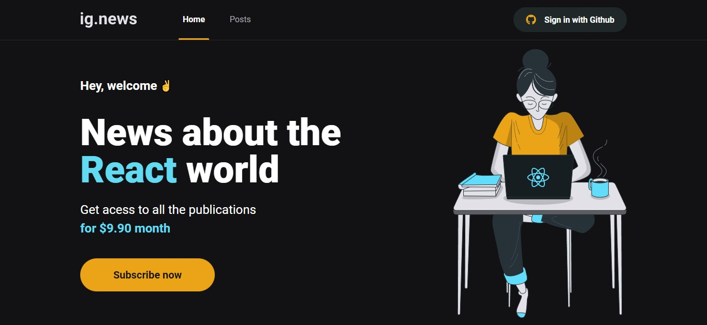

<h1 align="center"> ig.news </h1>

Projeto exclusivo, promovido pela Rocketseat para ensino de tecnologias WEB.

  <a href="#-tecnologias">Tecnologias</a>&nbsp;&nbsp;&nbsp;|&nbsp;&nbsp;&nbsp;
  <a href="#-projeto">Projeto</a>&nbsp;&nbsp;&nbsp;|&nbsp;&nbsp;&nbsp;
  <a href="#-layout">Layout</a>&nbsp;&nbsp;&nbsp;|&nbsp;&nbsp;&nbsp;
  <a href="#memo-licença">Licença</a>

  

 

  

## 🚀 Tecnologias

Esse projeto foi desenvolvido com as seguintes tecnologias:

- NextJS
- ReactJS
- TypeScript
- Stripe
- FaunaDB
- NextAuth.js
- Prismic CMS
- Git e Github

## 💻 Projeto

Ignews trata-se de um projeto onde simula a assinatura através de um valor para obter acesso ao conteúdo exclusivo dos posts.

## 🔖 Layout

Você pode visualizar o layout do projeto através [DESSE LINK](https://www.figma.com/file/ewzfaxJAFID5pOe7ZSRuWV/ig.news-(Copy)?node-id=1%3A2&t=bdUEcEWLT0ql2q47-0). É necessário ter conta no [Figma](https://figma.com) para acessá-lo.

## :memo: Licença

Esse projeto está sob a licença MIT.

---